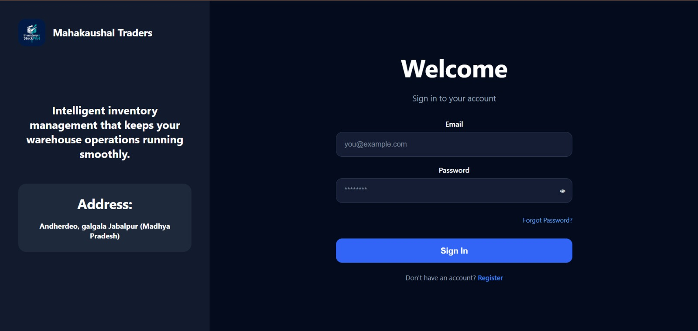
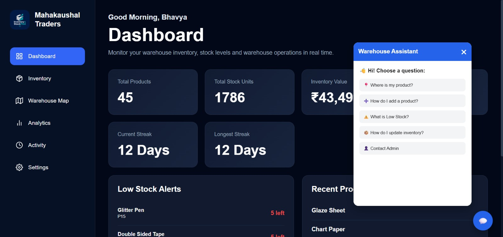
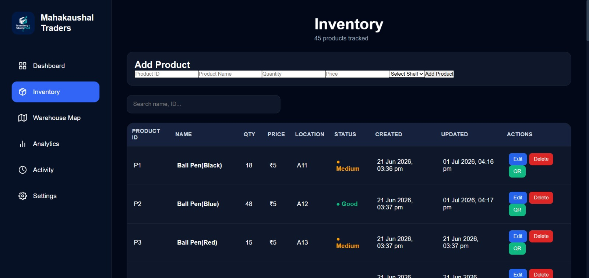
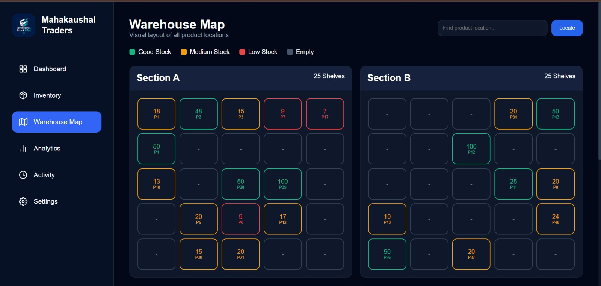
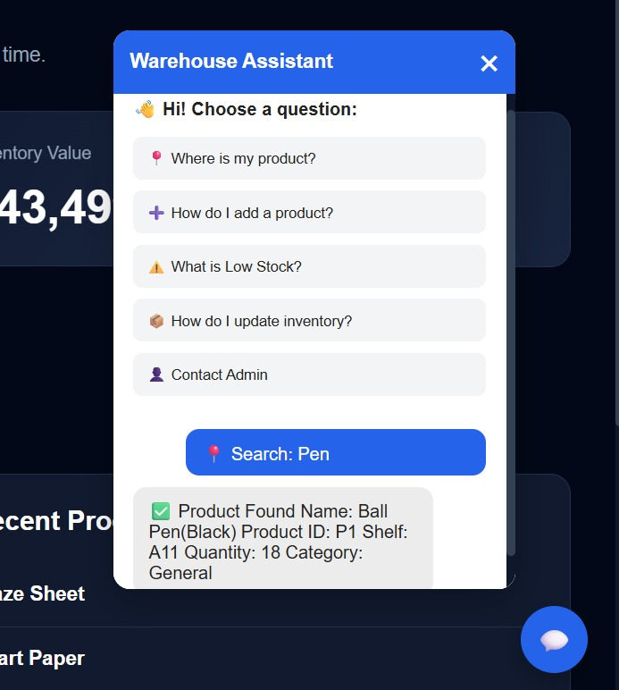
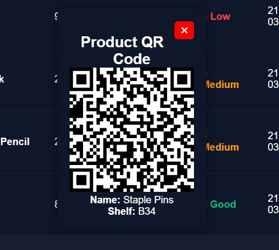
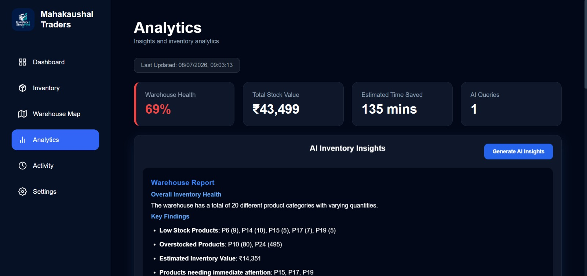

# StockPilot – AI-Powered Smart Warehouse & Inventory Management System

StockPilot is an AI-powered warehouse and inventory management platform designed for warehouses, retailers, wholesalers, and distributors. It streamlines inventory tracking, warehouse organization, QR-based product identification, AI-assisted inventory support, and real-time analytics through an intuitive web application.

The platform helps businesses reduce manual work, improve inventory visibility, minimize stock errors, and accelerate warehouse operations.

---

## Live Demo

**Frontend:** https:https://stockpilot-and-inventory-locator.vercel.app/

**Backend API:** https://stockpilot-and-inventory-locator.onrender.com/api

---

# Key Highlights

- Secure JWT Authentication
- Complete Inventory Management (CRUD)
- AI Warehouse Assistant powered by Groq
- Warehouse Shelf Mapping
- QR Code Generation & Scanning
- Smart Analytics using PostHog
- Low Stock Monitoring
- Inventory Dashboard
- Responsive Modern UI

---

# 📸 Application Screenshots

| Login | Dashboard |
|-------|-----------|
|  |  |

| Inventory | Warehouse Locator |
|------------|-------------------|
|  |  |

| AI Warehouse Assistant | QR Code Generation |
|-------------------------|--------------------|
|  |  |

---

## Product Analytics (PostHog)



## Warehouse Locator


---

## AI Warehouse Assistant


---

# Features

## Authentication

- Secure User Registration
- Secure Login
- JWT Authentication
- Password Encryption using bcrypt
- Protected Routes

---

## Smart Dashboard

Provides a complete warehouse overview including:

- Total Products
- Total Inventory Value
- Low Stock Products
- Recently Added Products
- Quick Navigation Cards
- AI Assistant Access

---

## Inventory Management

Complete product management system with CRUD operations.

Features include:

- Add Products
- Edit Products
- Delete Products
- Search Products
- Product Categories
- Quantity Tracking
- Shelf/Rack Allocation
- Product Pricing
- Automatic Timestamps

---

## AI Warehouse Assistant

Powered by **Groq LLM**, the AI assistant helps users with:

- Product Lookup
- Inventory Queries
- Stock Information
- Warehouse Assistance
- Inventory Guidance

---

## Warehouse Locator

Quickly locate products inside the warehouse.

Features include:

- Visual Shelf Mapping
- Rack-wise Organization
- Easy Product Search
- Organized Storage Layout

---

## QR Code Integration

Each product automatically receives a unique QR Code.

Features:

- Generate QR Codes
- Download QR Codes
- Print QR Codes
- Quick Product Identification

---

## Low Stock Monitoring

Automatically identifies products with low inventory.

Features:

- Low Stock Alerts
- Dashboard Warning Cards
- Inventory Monitoring

---

## Product Analytics

StockPilot integrates **PostHog Analytics** to monitor product usage and improve user experience.

Tracked Events include:

- User Login
- Dashboard Visits
- Product Added
- Product Updated
- Product Deleted
- QR Code Generated
- QR Code Scanned
- Warehouse Searches
- AI Chatbot Usage
- Inventory Updates

---

## Modern User Interface

- Responsive Design
- Professional Dashboard
- Interactive Cards
- Mobile Friendly
- Clean User Experience

---

# Technology Stack

| Category | Technologies |
|-----------|--------------|
| Frontend | React.js, Vite, React Router, Axios, CSS3, React Icons |
| Backend | Node.js, Express.js |
| Database | MongoDB Atlas, Mongoose |
| Authentication | JWT, bcryptjs |
| AI Integration | Groq API |
| Analytics | PostHog |
| QR Code | QRCode |
| Deployment | Vercel, Render |
| Version Control | Git & GitHub |

---

# System Architecture

```
                 React + Vite Frontend
                         │
                         │ REST API
                         ▼
                 Express.js Backend
                  │        │
                  │        │
                  ▼        ▼
          MongoDB Atlas   Groq AI
                  │
                  ▼
           PostHog Analytics
                  │
                  ▼
        StockPilot Warehouse System
```

---

# Project Structure

```
StockPilot-and-Inventory-Locator/

├── frontend/
│
│   ├── src/
│   │   ├── assets/
│   │   ├── components/
│   │   ├── pages/
│   │   ├── services/
│   │   ├── App.jsx
│   │   └── main.jsx
│
├── backend/
│
│   ├── config/
│   ├── controllers/
│   ├── middleware/
│   ├── models/
│   ├── routes/
│   ├── server.js
│   └── package.json
│
└── README.md
```

---

# Installation

## 1. Clone Repository

```bash
git clone https://github.com/reocodes-51/Stockpilot-and-Inventory-Locator.git

cd Stockpilot-and-Inventory-Locator
```

---

## 2. Backend Setup

```bash
cd backend

npm install
```

Create a `.env` file:

```env
PORT=5000

MONGO_URI=your_mongodb_connection_string

JWT_SECRET=your_secret_key

GROQ_API_KEY=your_groq_api_key
```

Run Backend

```bash
npm start
```

---

## 3. Frontend Setup

```bash
cd frontend

npm install

npm run dev
```

Frontend

```
http://localhost:5173
```

Backend

```
http://localhost:5000
```

---

# API Endpoints

## Authentication

```
POST /api/auth/register

POST /api/auth/login

POST /api/auth/send-otp

POST /api/auth/verify-otp

POST /api/auth/forgot-password

POST /api/auth/reset-password
```

## Products

```
GET /api/products

POST /api/products

PUT /api/products/:id

DELETE /api/products/:id
```

---

# Deployment

| Service | Platform |
|----------|----------|
| Frontend | Vercel |
| Backend | Render |
| Database | MongoDB Atlas |
| Analytics | PostHog |

---

# Use Cases

StockPilot is suitable for:

- Warehouses
- Retail Stores
- Wholesale Businesses
- Distribution Centers
- Manufacturing Units
- Logistics Companies
- Inventory Management Teams

---

# Future Improvements

- Worker Role Management
- Barcode Scanner Integration
- Multi-Warehouse Support
- AI Demand Forecasting
- WhatsApp Order Notifications
- Invoice & Billing Module
- Advanced Business Analytics
- Supplier Management

---

# Contributing

Contributions, feature suggestions, and improvements are welcome.

1. Fork this repository
2. Create your feature branch
3. Commit your changes
4. Push your branch
5. Open a Pull Request

---

# Team

**Developed by**

- Rajyavardhan Singh Rathore
- Bhavya Vaish

Project developed as part of the **Future Founders Internship**.

---

# Support

If you found this project useful, consider giving it a **Star ⭐** on GitHub.

Your support helps us continue improving StockPilot!

---
